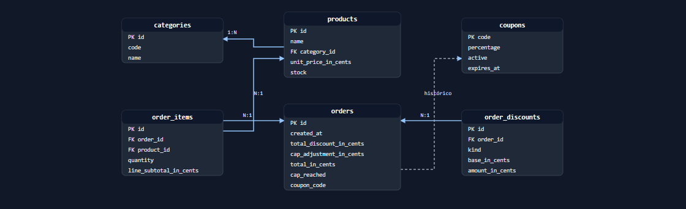

# Arquitectura

## 1. Por qué este stack y este diseño de carpetas

```
examen-ecommerce/
├── apps/
│   ├── backend/     Node 24 · Express · TypeScript · TypeORM · PostgreSQL
│   └── frontend/    Angular 22 · PrimeNG · PrimeFlex · Atomic Design
├── packages/
│   └── shared/      DTOs, tipos y validadores compartidos
└── docs/
```

**Monorepo con npm workspaces.** El contrato entre backend y frontend es el punto
más frágil de una aplicación full stack: es donde un cambio silencioso rompe al
otro lado sin que nadie se entere hasta producción. Con un paquete compartido,
renombrar un campo de `QuoteResponseDto` **rompe la compilación del frontend**,
que es exactamente cuando se quiere descubrir. Se eligió npm workspaces sobre Nx
porque el proyecto tiene tres paquetes: la caché de tareas y el grafo de
dependencias de Nx resolverían un problema que aquí no existe, a cambio de
configuración generada que habría que justificar.

**Backend hexagonal.** El enunciado premia aislar las reglas matemáticas de la
persistencia y del transporte. La arquitectura hexagonal es literalmente eso:

```
domain/          reglas de negocio. No importa Express, TypeORM ni HTTP
  models/        Money, Percentage, Product, Cart, Coupon, Order
  discounts/     el motor: reglas, fábrica, cascada y política de tope
  ports/         lo que el dominio necesita del exterior, en sus términos
application/     casos de uso que orquestan dominio y puertos
infrastructure/  adaptadores: Express, TypeORM, reloj, generador de ids
```

La prueba de que el aislamiento es real: **la API completa se monta en las pruebas
con adaptadores en memoria**, sin base de datos, ejercitando controladores,
validación, casos de uso y motor.

**Frontend con Atomic Design.** Los componentes de `ui/` no conocen los stores:
reciben datos por `input` y emiten intenciones por `output`. Solo la página
—el contenedor— habla con el estado. Por eso cada átomo y molécula se prueba en
aislamiento y la página se prueba entera de una vez.

## 2. Trade-offs asumidos

| Decisión | Ganancia | Coste aceptado |
|---|---|---|
| **Cotizar contra el servidor** en cada cambio del carrito | El desglose que se ve es exactamente el que calculó el motor: cliente y servidor no pueden discrepar | 250 ms de espera tras cada cambio |
| **Modelo de dominio ≠ entidad de TypeORM**, con mappers | Un stock negativo guardado en la base **falla al mapear** en vez de llegar al motor | Más código y una traducción que mantener |
| **Dinero en centavos enteros**, nunca decimales | La cascada de tres descuentos no arrastra error de coma flotante | Formatear es responsabilidad del frontend |
| **Bloqueo pesimista** en el checkout | Dos clientes no pueden comprar la última unidad | Serializa los checkouts sobre los mismos productos |
| **npm workspaces** en vez de Nx | Cero configuración que justificar; transparente en la defensa | Sin caché de tareas |
| **Sin autenticación**, sesión simulada | Todo el tiempo fue al motor, la cobertura y la documentación | La sesión no es real, y está documentado |
| **Carrito no persistido** | Sin identidad de sesión ni endpoints extra | Se pierde al recargar la página |
| **Dos runners de prueba** (Jest y Vitest) | Cada capa usa la herramienta nativa de su stack | Dos reportes de cobertura |

## 3. Cómo se aislaron las reglas matemáticas

Tres barreras, en orden desde el núcleo:

1. **El motor no conoce el mundo.** `DiscountEngine` recibe un `Cart`, un `Coupon`
   y una fecha, y devuelve un desglose. No importa Express, ni TypeORM, ni el DTO
   de respuesta. Sus 56 pruebas se ejecutan sin levantar nada.

2. **Los puertos hablan el idioma del dominio.** `ProductRepository` devuelve
   `Product`, no filas. `CheckoutUnitOfWork` expone `lockProducts`, no
   `SELECT ... FOR UPDATE`. La tecnología queda del otro lado de la interfaz.

3. **La traducción vive en un solo sitio.** `api.mapper.ts` convierte objetos de
   valor en números planos, y `persistence.mapper.ts` traduce entidad ↔ dominio.
   Fuera de esos dos archivos, `Money` nunca se convierte en `number`.

El resultado medible: cambiar de PostgreSQL a otro motor toca
`composition-root.ts` y los adaptadores. **El motor de descuentos no se entera.**

## 4. Patrones de diseño aplicados

### Strategy — cada regla de descuento

`domain/discounts/discount-rule.ts` define el contrato; cada regla lo implementa:

```ts
export interface DiscountRule {
  readonly kind: DiscountKind;
  apply(input: DiscountRuleInput): DiscountRuleResult | null;
}
```

`CategoryDiscountRule`, `VolumeDiscountRule` y `CouponDiscountRule` **se ignoran
entre sí**: ninguna sabe cuántas reglas hay, en qué orden corren ni que existe un
tope. Añadir una promoción es escribir una clase, no tocar el motor.

Devolver `null` significa *"no aplico"*, distinto de conceder cero: lo primero no
aparece en el desglose.

### Factory — la precedencia en un solo lugar

`DiscountRuleFactory` concentra **qué** reglas existen y **en qué orden**. El motor
recibe una lista ya ordenada y no conoce ninguna clase concreta, así que la
precedencia del enunciado es verificable con una prueba:

```ts
expect(rules.map((rule) => rule.kind)).toEqual(['CATEGORY', 'VOLUME', 'COUPON']);
```

### Repository / Ports & Adapters — la persistencia

`domain/ports/repositories.ts` declara lo que el dominio necesita. Los adaptadores
de TypeORM lo implementan y los dobles en memoria también, y por eso los casos de
uso se prueban completos sin base de datos.

`CheckoutUnitOfWork` es el puerto más interesante: su `lockProducts` **exige** al
adaptador bloquear las filas hasta el commit. Sobre PostgreSQL se traduce en
`FOR UPDATE OF "ProductEntity"`.

### Observer — el estado del carrito

`CartStore` guarda una sola señal privada con las líneas; todo lo demás son
valores derivados: subtotal, unidades, cantidades indexadas y el payload de la
API. Los componentes se suscriben a lo que necesitan y Angular recalcula solo esa
parte. Es el patrón Observer delegado en el framework: sin notificaciones
manuales y sin estado duplicado que pueda desincronizarse.

## 5. El tope del 35%

La regla 4 del enunciado es **inalcanzable con sus propios números**: la cascada
`0.90 × 0.95 × 0.85` topa en un descuento efectivo del **27.325%**.

Se implementó como política real —`DiscountCapPolicy`, separada de las
estrategias porque no concede descuento sino que lo limita— con los porcentajes y
el tope inyectados por configuración. El perfil por defecto reproduce el
enunciado; el cupón `MEGA50` permite demostrar el truncamiento en vivo.

El recorte se reporta como `capAdjustment` **explícito** en lugar de repartirse
entre las reglas, para que el desglose siga cuadrando y el cliente entienda por
qué su ahorro no es la suma de las tres líneas.

## 6. Consistencia del checkout

```
BEGIN
  SELECT ... FROM products WHERE id IN (...) FOR UPDATE OF products
  verificar stock ya bloqueado
  recalcular descuentos en el servidor, sin confiar en el cliente
  descontar stock e insertar la orden
COMMIT
```

Bloquear **antes** de verificar es lo que impide el clásico "dos clientes compran
la última unidad". Si cualquier paso falla, el rollback deshace también el
descuento de stock: nunca queda stock consumido sin su orden.

La base de datos refuerza lo que el motor promete:

```sql
CHECK (stock >= 0)
CHECK (original_subtotal_in_cents - total_discount_in_cents = total_in_cents)
```

## 7. Modelo de datos



Dos decisiones a destacar:

- **`order_items` congela nombre, precio y categoría.** Un cambio de precio mañana
  no puede reescribir lo que un cliente pagó ayer.
- **`order_discounts` guarda una fila por regla aplicada**, con su base y su
  monto. Añadir una cuarta promoción no exige `ALTER TABLE`, y el desglose se
  puede auditar en SQL. La columna `sequence` preserva el orden de la cascada,
  porque la base de datos no promete orden de filas.

La referencia de `orders` a `coupons` **no lleva clave foránea**: el código se
guarda como dato histórico, para que retirar un cupón no invalide compras pasadas.

## 8. Estrategia de pruebas

| Paquete | Runner | Pruebas | Cobertura |
|---|---|---|---|
| `packages/shared` | Jest | 27 | 100% |
| `apps/backend` | Jest | 239 | 98.6% |
| `apps/frontend` | Vitest | 157 | 97.6% |

Los casos de borde que exige el enunciado, y dónde están:

| Caso | Ubicación |
|---|---|
| Tope del 35% superado | `discount-engine.test.ts` |
| Tope alcanzado exacto, sin truncar | `discount-cap.policy.test.ts` |
| Carrito vacío | `cart.test.ts`, `quote-cart.use-case.test.ts` |
| Datos corruptos y payload inválido | `cart.schema.test.ts`, `app.test.ts` |
| Cupón inexistente, vencido y desactivado | `coupon.test.ts`, `discount-engine.test.ts` |
| Stock insuficiente y rollback | `checkout.use-case.test.ts` |
| Umbral de 100 USD exacto | `discount-rules.test.ts` |
